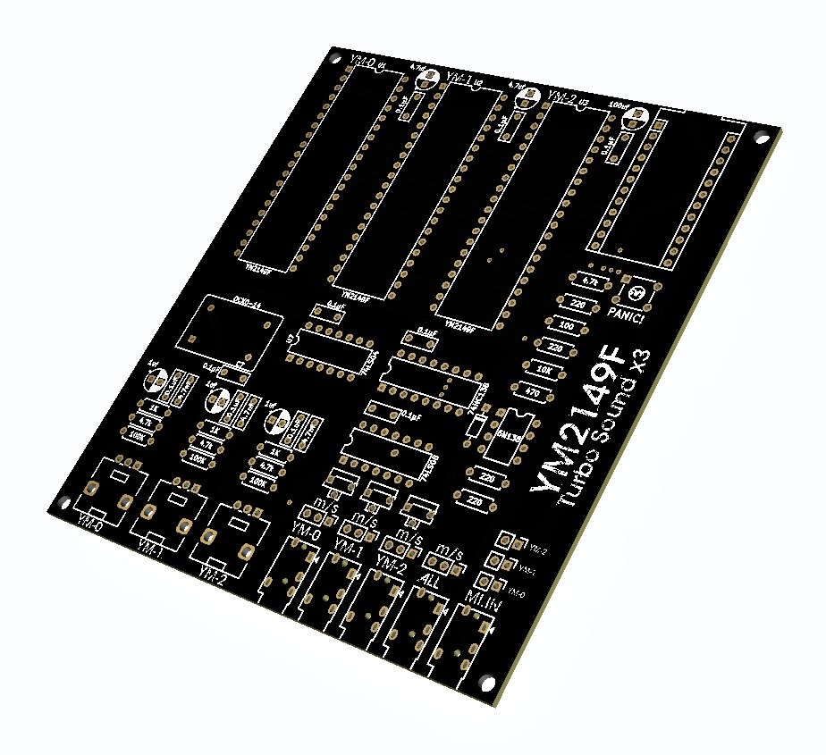

# YM2149F Polyphonic Synth - Turbo Sound x 3

An Arduino Pro Micro-based polyphonic synthesizer using three Yamaha YM2149F sound chips, complete with MIDI input, per-channel pitch bend, vibrato, expression, portamento and noise-based drum channel, and LED indicators.

## Features

- **3× YM2149F Chips**: Provides 9 independent tone voices (3 per chip).  
- **MIDI Input**: Supports USB-MIDI (via MIDIUSB library) and TRS-serial MIDI (31250 baud).  
- **Per-Channel Voice Routing**: Maps MIDI channels 1–9 to specific chip voices:  
  - Channels 1–3 → Chip 0 voices A/B/C  
  - Channels 4–6 → Chip 1 voices A/B/C  
  - Channels 7–9 → Chip 2 voices A/B/C  
- **Pitch Bend & Vibrato**: Standard pitch bend (±2 semitones) and CC1 mod-wheel vibrato.
- **Other Standard CC**: Velocity, Expression, Portamento, Sweep, Envelope
- **Drum Noise Channels**: MIDI channels 10 trigger noise percussion on chip 2.  
- **LED Indicators**: LEDs light when each YM chip is active, with inverted logic (LOW = on).  
- **74HC138 Decoder**: Selects among the three chips via A/B/C lines.
- **Serial playback support**: Compatible player is a work in progress..
- **Digidrums**: Work in progress..

## Hardware

<h1 align="center">
    
</h1>

### Components

- Arduino Pro Micro (ATmega32U4, 5V)  
- 3 × YM2149F sound chips  
- 74HC138 3-to-8 decoder for chip select  
- Logic gates (74LS08, 74LS04)
- 8 × digital lines for data bus (D0–D7)  
- Control lines: BC1, BDIR, RESET, clock output  
- Audio mixing: resistors + capacitor per channel  
- 3 × LEDs for chip activity  
- 3.5 mm stereo jack for audio output  

### Pin Connections

| Arduino Pin | Function       | YM2149F / 74HC138                    |
|-------------|----------------|--------------------------------------|
| 2–9         | D0–D7          | Data bus D0–D7                       |
| 10          | BC1            | YM2149F BC1                          |
| 20          | BDIR           | YM2149F BDIR                         |
| A3, A1, A0  | SEL A, B, C    | 74HC138 A, B, C inputs               |
| A2          | Enable (high)  | 74HC138 enable                       |
| 9           | Clock out      | YM2149F CLK                          |
| 15 (RESET)  | nRESET         | YM2149F RESET                        |
| LEDs        | 16, 14, 15     | Chip 0, 1, 2 indicator (LOW = on)    |

## Software Setup

1. **Install Arduino IDE** (v1.8 or later). 
2. **Add MIDIUSB library** via Library Manager.
3. **Download or clone** this repo.  
4. **Load `ym2149f-turbo-sound-x3.ino`** in Arduino IDE.  
5. **Select Board “Arduino Pro Micro”** select the COM port, and upload (ctrl + u).  

## Usage

- Connect USB-MIDI to a PC or MAC or use a TRS-MIDI cable.  
- Send notes on channels 1–9 to play polyphonic voices.  
- Use pitch bend wheel for ±2 semitone bends.  
- CC 1 – Mod Wheel → scales vibrato depth
- CC 4 – Volume Env Shape: 0=OFF, 1–63=Ramp up, 64–127=Ramp down
- CC 5 – Portamento Time → glide speed (0.005–0.5)
- CC 7 – Channel Volume → alternate expression control
- CC 9 – Pitch Sweep Amount → max semitone sweep (0–2 semis)
- CC 10 – Pitch Sweep Envelope → < 64 = attack, ≥ 64 = release shape
- CC 11 – Expression → per-channel volume scaling
- CC 64 – Sustain On/Off → ≥ 64 enables sustain (Send all notes off or set to 0 to stop)
- CC 65 – Portamento On/Off → ≥ 64 enables glide
- CC 76 – Vibrato Rate → 0–10 Hz LFO speed
- CC 77 – Vibrato Depth → 0–2 semitone LFO range
- CC 85 – Vibrato Delay
- CC 120/123 – All Sound/All Notes Off → channel reset
- Noise - Send on MIDI channel 10 (Chip 3 / YM2).  
- LEDs will flash when each chip is active.

## Hardware
https://hobbychop.etsy.com - YM2149F Turbo Sound x3

## Contributors
Special thanks to Ben Baker for his support and code contributions: https://baker76.com, https://github.com/benbaker76

Ym2149Synth by trash80 - YM2149F project on which some CC code is based. https://github.com/trash80/Ym2149Synth
